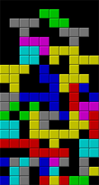
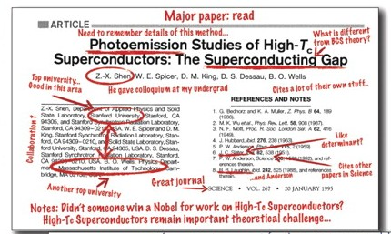
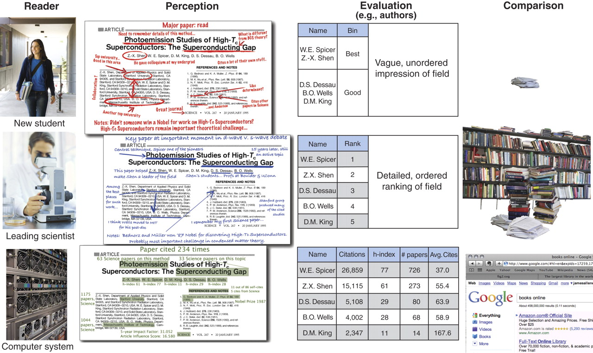

# Global Change


<small> Overpeck+ (2011) doi:[10.1126/science.1197869](http://doi.org/10.1126/science.1197869) </small>

<!--
Uncertainty in outcomes
-->

----

# Fishery Collapse?


<small> Worm+ (2006) doi:[10.1126/science.1132294](http://doi.org/10.1126/science.1132294)</small>

---


# Tipping points?


<small> Barnoksy+ (2012) doi:[10.1038/nature11018](http://doi.org/10.1038/nature11018)</small>

<!-- From linear to nonlinear thinking. Must deal with the uncertainty-->

---

# Me


# Early warning signs?


# Ecological management under uncertainty:

 

<small> credit: NOAA </small>


-----

# Decision Theory


<!--

Classical Decision theory / optimal control
Complex problems need diverse data
It's not about the data we have. It's about reacting to the data we will have.

FedEx truck.  Decision theory has not been data driven. Scales poorly. Has high expectations of the models.
Thesis: Big data challenges and opportunities.

In the context of my research... Tipping points, uncertainty and decision theory
- Problems of global change
- New methodology that can take better advantage of big data
-->


# Remote sensors


<small>credit: NASA</small>

----

# micro sensors


<small>credit: NSF </small>

----


## NEON


<small> credit: Hopkin (2006) doi:[10.1038/444420a](http://doi.org/10.1038/444420a) </small>

----

## OOI


<small> credit: Witze (2013) doi:[10.1038/501480a](http://doi.org/10.1038/501480a) </small>

# Computer simulations


<small> credit: NERSC </small>

<!-- 9,984 cores 106 teraflops -->

----


# Field-based study


<small>credit: Scambos & Bauer, [NSIDC](http://nsidc.org/cryosphere/quickfacts/icesheets.html)</small>

----


# Growth of climate data by type


<small> Overpeck+ (2011) doi:[10.1126/science.1197869](http://doi.org/10.1126/science.1197869) </small>


<!--

# and growing fast

- *data generated worldwide (now dominated by sensor data) is growing by 58% per year*
- *in 2010 the world generated 1250 billion gigabytes of data.*
- *in 2007 the world produced more data than could fit in all of the world’s storage*

<small> Baraniuk (2011) doi:[10.1126/science.1197448](http://doi.org/10.1126/science.1197448) </small>

-->

# What is "a lot" of data?

---

# 100 MB?

---

# 100 GB?

---

# 100 PB?

---

# Big enough to be a problem

----

# Engineering bottlenecks


<small> Baraniuk (2011) doi:[10.1126/science.1197448](http://doi.org/10.1126/science.1197448) </small>

----

# Science bottlenecks


<small>adapted from Reichman+ (2011) doi:[10.1126/science.1197962](http://doi.org/10.1126/science.1197962)</small>

----


<h3> Different ways to be big </h3>

<h2> Volume </h2>
<h2> Variety </h2>
<h2> Velocity </h2>

<!-- Each of these can break our hardware (disks/algorithms/networks), but that's relatively generic problem.
Particularly interested in how this breaks our _Science_, changes to the research process to that better address this.
That is: the management and analysis of massive data in the context global change research
Research that _scales_

-->
---


# data visualization

> today the visualization and analysis component has become a bottleneck

<small> Fox & Hendler (2011) doi:[10.1126/science.1197654](http://doi.org/10.1126/science.1197654) </small>

<!--

> A consequence of the major effort for visualization is that it becomes an end product of scientific analysis, rather than an exploration tool

> stop thinking of visualization as a necessary evil at the end of the scientific pipeline and use it as a tool in data comprehension.

> Many other data visualizations on the Web are becoming increasingly more sophisticated and interactive, while at the same time becoming easier to generate thanks to the prevalence of open Application Programming Interfaces ..

> Despite the increasing prevalence of these techniques on the Web, we are often looking at tables of numbers, best-fit curves, or other analytic results rather than being able to use visual means when we interact with the complex scientific data in many fields. Many of the visualization tools that are available to scientists do not allow live linking as do these Web-based tools. Once the visualization is created, it is no longer tied to the data ...


-->

# data visualization


<small> Fox & Hendler (2011) doi:[10.1126/science.1197654](http://doi.org/10.1126/science.1197654) </small>

---

> Most scientific data is created in a form that facilitates its generation rather than focusing on its eventual use.

<small> Fox & Hendler (2011) doi:[10.1126/science.1197654](http://doi.org/10.1126/science.1197654) </small>

-----


# Variety

---

# Factory Farm Data...


<small>credit: Arthus-Bertrand</small>

----

# ... Organic, hand-crafted variety


<small>credit: Arthus-Bertrand</small>


----

# Vertically integrated data repositories


-----

# The rOpenSci project

building tools, building community


# World Bank Climate Data (Example)

IPCC records and model projections at your fingertips

```r
library("rWBclimate")
country.list <- c("USA", "CAN")
country.dat <- get_historical_temp(country.list, "year")

ggplot(country.dat, aes(x = year, y = data, group = locator)) +
  geom_point() + geom_path() + xlab("Year") +
  ylab("Average annual temperature") +
  stat_smooth(se = F, colour = "black") +
  facet_wrap(~locator, scale = "free") + theme_bw()
```
----

# World Bank Climate Data (Example)

IPCC records and model projections at your fingertips


----

# UN FAO Fisheries data (Example)


```r
library("rfisheries")
species <- of_species_codes()
who <- c("TUX", "COD", "VET", "NPA")
by_species <- lapply(who, function(x) of_landings(species = x))

names(by_species) <- who
dat <- melt(by_species, id = c("catch", "year"))[, -5]
names(dat) <- c("catch", "year", "species", "a3_code")
ggplot(dat, aes(year, catch)) + geom_line() +
  facet_wrap(~a3_code, scales = "free_y") + theme_bw()
```

----

# UN FAO Fisheries data (Example)


----


# GBIF

<iframe id="mapByFrame" name="map" src="http://cdn.gbif.org/v0.9/map/index.html?type=ALL&resolution=1&style=dark" allowfullscreen height="600" width="100%" frameborder="0"></iframe>


- `library("rgbif")`

---

# Limitations to vertical integration



---

# Metadata-driven repositories

---

# Metadata Standards


<small>Jones+ (2006) doi:[10.1146/annurev.ecolsys.37.091305.110031](http://doi.org/10.1146/annurev.ecolsys.37.091305.110031)</small>

---


# KNB

<iframe src="https://knb.ecoinformatics.org/#data/page/0" height="600" width="100%" frameborder="0"></iframe>

----


# Quality vs Quantity

- There are no good data, bad data
- Some are just missing metadata

---

# Communicating data limitations

> effective interdisciplinary communication of data limitations with regard to, for example,

- spatial and temporal sampling uncertainties;
- instrument changes;
- quality-control procedures; and, in particular,
- what model-based climate predictions or projections do well and not so well.


<small> Overpeck+ (2011) doi:[10.1126/science.1197869](http://doi.org/10.1126/science.1197869) </small>

----

# EML

- <h2> Easy to <strong>use</strong> existing metadata </h2>
- <h2> Easy to <strong>generate</strong> metadata </h2>
- <h2> Easy to <strong>enhance</strong> & improve data with further annotation </h2>


---

# Compare this to the standard publication...

----

## How a new student sees a paper



---

## How a leading professor sees it


----

## How a computer sees it


----

## Metaknowledge




<small>Evans+ doi:[10.1126/science.1201765](http://doi.org/10.1126/science.1201765)</small>

----


# Formal semantics


<small>Mitchner (2012) doi:[10.1016/j.tree.2011.11.016](http://doi.org/10.1016/j.tree.2011.11.016)</small>

---

# Data sharing

> Although research scientists have been the main users of these data, an increasing number of resource managers (working in fields such as water, public lands, health, and marine resources) need and are seeking access to climate data to inform their decisions, just as a growing range of policy-makers rely on climate data to develop climate change strategies

<small> - Overpeck+ (2011) doi:[10.1126/science.1197869](http://doi.org/10.1126/science.1197869) </small>


---

# Data Sharing?

- Whitehouse mandates
- Journal mandates
- Funder mandates

----

# Velocity


<!-- We're talking about global change here. Clock's ticking...
- You sometimes hear "we have enough data. Let's just analyze what we have."
- I disagree.  There's so much we've never measured.
- Let's speed up the analysis instead.
-->

# Speed of algorithms

 

<small>credit: The Economist</small>


---

# Data synthesis is another bottleneck

- Is today's research based on yesterday's data?
- The exponential growth of data suggests that most of the data yet to come
- Revisit and design today's analyses to account for tomorrow's data

----


# Example: Synthetic analysis of biodiversity loss


Synthesizes over 140 data sets.

---

# Finds no evidence for systematic loss


How easy would it be to update this to reflect new data?

----


# From bottlenecks to workflows


<small>adapted from Reichman+ (2011) doi:[10.1126/science.1197962](http://doi.org/10.1126/science.1197962)</small>


----

# From bottlenecks to workflows


<small>Reichman+ (2011) doi:[10.1126/science.1197962](http://doi.org/10.1126/science.1197962)</small>

----

# Example workflows: Dynamic documents


<small>Peng (2011) doi:[10.1126/science.1213847](http://doi.org/10.1126/science.1213847)</small>

----

# IPython


<small>Mascarelli (2014) doi:[10.1038/nj7493-523a](http://doi.org/10.1038/nj7493-523a)</small>

---


# Reproducible research


<small>credit: The Economist</small>

---


<small>credit: The Economist</small>

---

# Sharing code?


# Velocity of data vs velocity of policy?


<small> credit: Wikipedia </small>


# Conclusions

Global change problems are increasingly data driven, bringing new challenges and opportunities:

- Volume: We often hit science bottlenecks before hardware bottlenecks.
- Variety: We need metadata driven repositories for diverse data.
- Velocity: Workflows for the data of tomorrow

---

# Thank you

- NSF
- Sloan Foundation
- NOAA / CSTAR
- Karthik Ram
- Scott Chamberlain
- Ted Hart
- Matt Jones
- Marc Mangel

## Links

- [ropensci.org](http://ropensci.org)
- slides: [io.carlboettiger.info/globalchange](http://cboettig.github.com/globalchange)

----


<!--

## Diminishing returns?

- One good paper is very useful
- how about 100 more?
- 10^6 more?
- at least 2 papers are published every minute
<small>([Bjork+ 2008](http://elpub.scix.net/cgi-bin/works/Show?178_elpub2008))</small>

---

-->


