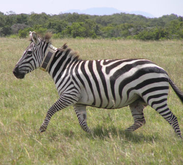
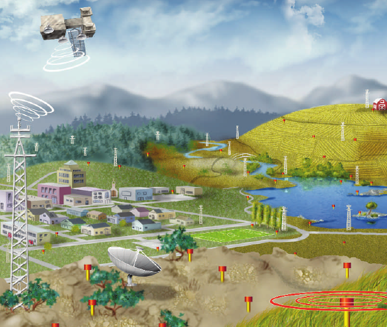
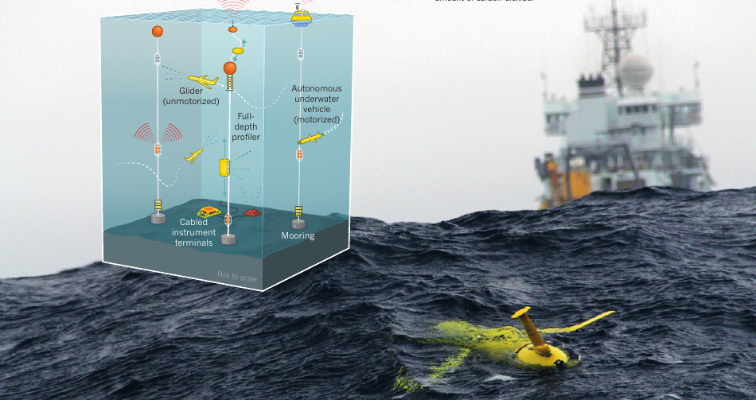
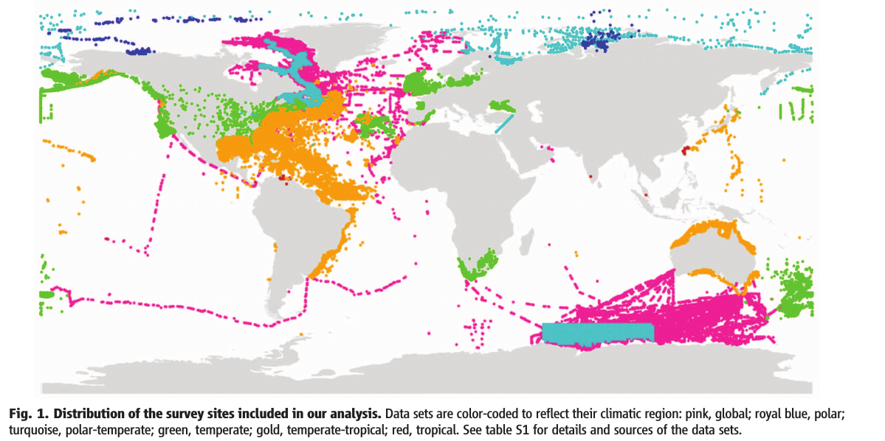
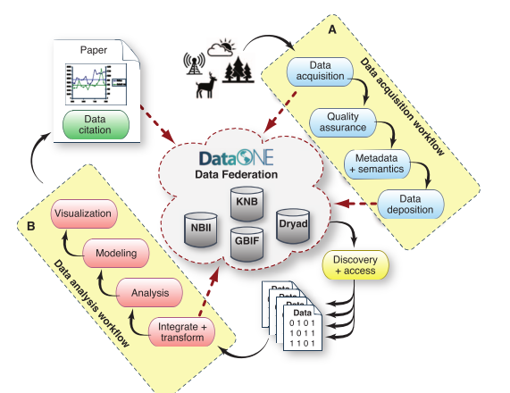
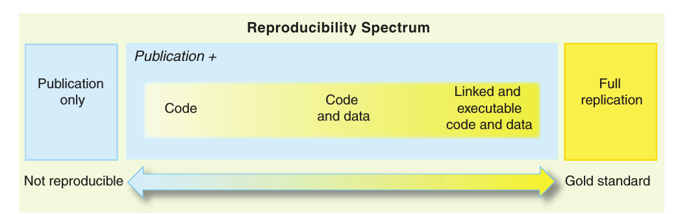

## The rOpenSci project

building tools, building community


## Packages

<iframe src="http://status.ropensci.org" height="600" width="100%" frameborder="0"></iframe>

## Contributors

<iframe src="http://ropensci.org/community" height="600" width="100%" frameborder="0"></iframe>

## Community

- ROpenSci Blog: [ropensci.org/blog](http://ropensci.org/blog/)
- Community Calls: [github.com/ropensci/commcalls](https://github.com/ropensci/commcalls)
- UnConference: [unconf.ropensci.org](http://unconf.ropensci.org/)
- ROpenSci Github: [github.com/ropensci](https://github.com/ropensci)
- ROpenSci Twitter: @ [rOpenSci](https://twitter.com/ropensci)

## Goals

- Increase the availability and quality of R packages to interface with research data
- Support reproducibility along the whole data analysis pipeline
- Sustainable software design
- Sustainable community 


```{r include=FALSE}
library(ggplot2)
library(knitr)
knitr::opts_chunk$set(
  comment = "# ",
  error = FALSE,
  cache = TRUE,
  message = FALSE,
  warning = FALSE)
```

## Remote sensors


 credit: NASA 

## micro sensors



 credit: NSF  


## NEON



  credit: Hopkin (2006) doi: [ 10.1038/444420a](http://doi.org/10.1038/444420a)  

## OOI



  credit: Witze (2013) doi: [ 10.1038/501480a](http://doi.org/10.1038/501480a)  

## Computer simulations


  credit: NERSC  

<!-- 9,984 cores 106 teraflops -->


## Field-based study


 credit: Scambos & Bauer, [NSIDC](http://nsidc.org/cryosphere/quickfacts/icesheets.html) 


## Growth of climate data by type


  Overpeck+ (2011) doi: [ 10.1126/science.1197869](http://doi.org/10.1126/science.1197869)  


# The real challenge is doing science today that is relevant to the data tomorrow


## Example: Synthetic analysis of biodiversity loss



Synthesizes over 140 data sets.


## Finds no evidence for systematic loss


How easy would it be to update this to reflect new data?


# What is "a lot" of data?


## Engineering bottlenecks


  Baraniuk (2011) doi: [ 10.1126/science.1197448](http://doi.org/10.1126/science.1197448)  

## From bottlenecks to workflows


 adapted from Reichman+ (2011) doi: [ 10.1126/science.1197962](http://doi.org/10.1126/science.1197962) 

## From bottlenecks to workflows



Reichman+ (2011) doi: [ 10.1126/science.1197962](http://doi.org/10.1126/science.1197962) 


## Example workflows: Dynamic documents



Peng (2011) doi: [10.1126/science.1213847](http://doi.org/10.1126/science.1213847)


