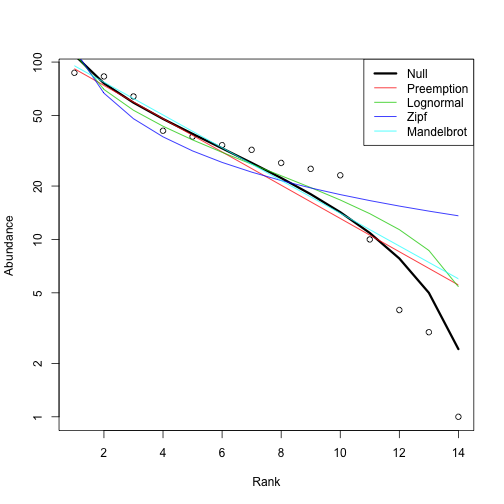

## Macroecology - testing the species-abundance distribution


```r
library(rbison)
library(ggplot2)
library(plyr)
library(doMC)
```


```r
mynames <- c("Helianthus annuus", "Pinus contorta", "Poa annua", "Madia sativa", 
    "Arctostaphylos glauca", "Heteromeles arbutifolia", "Symphoricarpos albus", 
    "Ribes viburnifolium", "Diplacus aurantiacus", "Salvia leucophylla", "Encelia californica", 
    "Ribes indecorum", "Ribes malvaceum", "Cercocarpus betuloides", "Penstemon spectabilis")
```


```r
getdata <- function(x, count = 2) {
    out <- bison(species = x, county = "Los Angeles", count = count)
    bison_data(out, "data_df")
}
```


```r
registerDoMC(cores = 4)
out <- ldply(mynames, getdata, count = 500, .parallel = TRUE)
df <- ddply(out, .(name), summarise, abd = length(name))
```


```r
library(vegan)
plot(radfit(df$abd))
```

 

