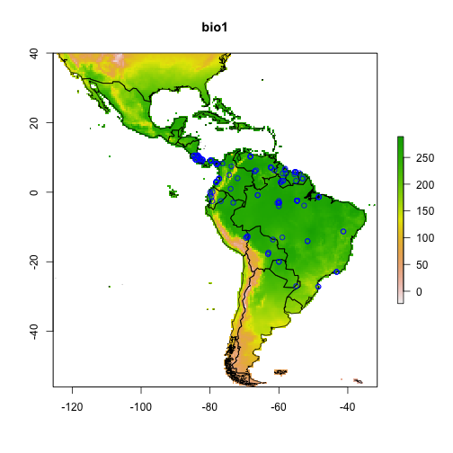

## rgbif use case No. 1 - Ecological niche modelling (aka species distribution modelling)


In this example, we plot actual occurrence data for *Bradypus* species against a single predictor variable, BIO1 (annual mean temperature). This is only ont step in a species distribution modelling nworkflow.

This example can be done using BISON data as well with our rbison package.

### Load libraries


```r
library('rgbif')
library('dismo')
library('maptools')
library('plyr')
```

### Make a list of files that are installed with the dismo package, then create a rasterStack from these


```r
files <- list.files(paste(system.file(package="dismo"), '/ex', sep=''), 'grd', full.names=TRUE)
predictors <- stack(files)
```

### Get world boundaries.


```r
data(wrld_simpl)
```

### Get GBIF data using the rOpenSci package rgbif.

Lookup names


```r
namesdf <- name_lookup(query='bradypus*', rank="SPECIES", limit=60)$data
head(namesdf)
```

```
#          key  nubKey parentKey   parent  kingdom   phylum  order
#  1 110269569 2436361 124846868 Bradypus Animalia Chordata Pilosa
#  2 110269558 2436351 124846868 Bradypus Animalia Chordata Pilosa
#  3 110579447 2436351 110606319 Bradypus Animalia Chordata Pilosa
#  4   2436351 2436351   2436350 Bradypus Animalia Chordata Pilosa
#  5 110516334 2436361 110606319 Bradypus Animalia Chordata Pilosa
#  6 110597512 2436353 110606319 Bradypus Animalia Chordata Pilosa
#          family    genus kingdomKey phylumKey  classKey  orderKey familyKey
#  1 Bradypodidae Bradypus  124836057 124839309 124846085 124846866 124846867
#  2 Bradypodidae Bradypus  124836057 124839309 124846085 124846866 124846867
#  3 Bradypodidae Bradypus  116630539 116842680 116665331 137067173 137067174
#  4 Bradypodidae Bradypus          1        44       359      1494      9418
#  5 Bradypodidae Bradypus  116630539 116842680 116665331 137067173 137067174
#  6 Bradypodidae Bradypus  116630539 116842680 116665331 137067173 137067174
#     genusKey        canonicalName     authorship   nameType    rank
#  1 124846868 Bradypus tridactylus Linnaeus, 1758 WELLFORMED SPECIES
#  2 124846868   Bradypus torquatus  Illiger, 1811 WELLFORMED SPECIES
#  3 110606319   Bradypus torquatus  Illiger, 1811 WELLFORMED SPECIES
#  4   2436350   Bradypus torquatus  Illiger, 1811 WELLFORMED SPECIES
#  5 110606319 Bradypus tridactylus Linnaeus, 1758 WELLFORMED SPECIES
#  6 110606319  Bradypus variegatus   Schinz, 1825 WELLFORMED SPECIES
#    numOccurrences
#  1              0
#  2              0
#  3              0
#  4              0
#  5              0
#  6              0
```

Get some name keys


```r
keys <- na.omit(unique(namesdf$nubKey))
```

Get occurrence data


```r
df <- occ_search(keys, hasCoordinate = TRUE, limit = 100, return = 'data')
df <- df[sapply(df, class) == "data.frame"]
df2 <- ldply(df)
df2 <- data.frame(lon=df2$decimalLongitude, lat=df2$decimalLatitude)
```

### Plot: (1) Add raster data, (2) Add political boundaries, (3) Add the points (occurrences)


```r
plot(predictors, 1)
plot(wrld_simpl, add=TRUE)
points(df2, col='blue')
```

 

### Further reading

The above example comes from [this tutorial][sdm] on species distribution modeling. 

Warning: tutorial no longer there...

[sdm]: http://cran.r-project.org/web/packages/dismo/vignettes/sdm.pdf
