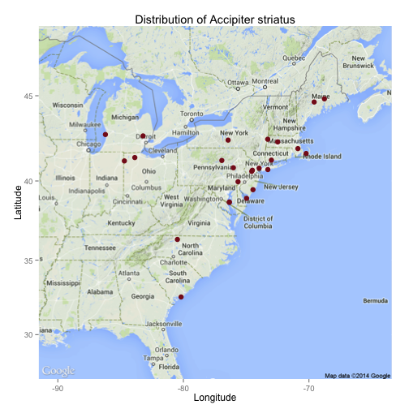

### spocc - Make some maps!

### Load libraries


```r
library('spocc')
```

### spocc unifies access to biodiversity data across sources


```r
out <- occ(query='Accipiter striatus', from='gbif')
out$gbif # GBIF data w/ metadata
```

```
## Species [Accipiter striatus (25)] 
## First 10 rows of [Accipiter_striatus]
## 
##                  name longitude latitude prov       key
## 1  Accipiter striatus    -72.53    43.13 gbif 891035349
## 2  Accipiter striatus    -97.20    32.86 gbif 891038901
## 3  Accipiter striatus    -71.73    18.27 gbif 891035119
## 4  Accipiter striatus    -97.65    30.16 gbif 891040018
## 5  Accipiter striatus   -122.44    37.49 gbif 891040169
## 6  Accipiter striatus    -73.07    43.63 gbif 891048899
## 7  Accipiter striatus    -76.64    41.86 gbif 891043765
## 8  Accipiter striatus   -117.15    32.70 gbif 891056214
## 9  Accipiter striatus    -97.88    26.10 gbif 891050439
## 10 Accipiter striatus    -99.10    26.49 gbif 891049443
## ..                ...       ...      ...  ...       ...
## Variables not shown: issues (chr)
```

```r
out$ebird$data # empty
```

```
## $Accipiter_striatus
## data frame with 0 columns and 0 rows
```

```r
out$gbif$meta #  metadata, your query parameters, time the call executed, etc. 
```

```
## $source
## [1] "gbif"
## 
## $time
## [1] "2014-09-24 16:34:20 PDT"
## 
## $found
## [1] 448876
## 
## $returned
## [1] 25
## 
## $type
## [1] "sci"
## 
## $opts
## $opts$taxonKey
## [1] 2480612
## 
## $opts$limit
## [1] 25
## 
## $opts$callopts
## list()
```

```r
out$gbif$data # just data
```

```
## $Accipiter_striatus
##                  name       key decimalLatitude decimalLongitude
## 1  Accipiter striatus 891035349           43.13           -72.53
## 2  Accipiter striatus 891038901           32.86           -97.20
## 3  Accipiter striatus 891035119           18.27           -71.73
## 4  Accipiter striatus 891040018           30.16           -97.65
## 5  Accipiter striatus 891040169           37.49          -122.44
## 6  Accipiter striatus 891048899           43.63           -73.07
## 7  Accipiter striatus 891043765           41.86           -76.64
## 8  Accipiter striatus 891056214           32.70          -117.15
## 9  Accipiter striatus 891050439           26.10           -97.88
## 10 Accipiter striatus 891049443           26.49           -99.10
## 11 Accipiter striatus 891054792           44.31           -73.24
## 12 Accipiter striatus 899956839           37.65          -122.50
## 13 Accipiter striatus 899971462           37.91          -122.26
## 14 Accipiter striatus 899964993           33.02           -96.84
## 15 Accipiter striatus 899979866           44.38           -73.14
## 16 Accipiter striatus 911495136           40.58           -79.86
## 17 Accipiter striatus 952027990           39.50           -95.02
## 18 Accipiter striatus 934998461           38.93           -74.96
## 19 Accipiter striatus 935047922           39.76           -74.11
## 20 Accipiter striatus 935049407           43.00           -82.28
## 21 Accipiter striatus 935068712           41.34           -70.82
## 22 Accipiter striatus 935069306           45.38           -92.48
## 23 Accipiter striatus 935070560           42.22           -71.61
## 24 Accipiter striatus 935146823           34.16          -119.04
## 25 Accipiter striatus 935147093           37.06           -78.47
##                 issues prov
## 1  cdround,cudc,gass84 gbif
## 2  cdround,cudc,gass84 gbif
## 3  cdround,cudc,gass84 gbif
## 4  cdround,cudc,gass84 gbif
## 5  cdround,cudc,gass84 gbif
## 6  cdround,cudc,gass84 gbif
## 7  cdround,cudc,gass84 gbif
## 8  cdround,cudc,gass84 gbif
## 9  cdround,cudc,gass84 gbif
## 10 cdround,cudc,gass84 gbif
## 11 cdround,cudc,gass84 gbif
## 12 cdround,cudc,gass84 gbif
## 13 cdround,cudc,gass84 gbif
## 14 cdround,cudc,gass84 gbif
## 15 cdround,cudc,gass84 gbif
## 16 cdround,cudc,gass84 gbif
## 17              gass84 gbif
## 18              gass84 gbif
## 19              gass84 gbif
## 20              gass84 gbif
## 21              gass84 gbif
## 22              gass84 gbif
## 23              gass84 gbif
## 24              gass84 gbif
## 25              gass84 gbif
```

And you can squash together data from sources easily


```r
out <- occ(query='Accipiter striatus', from=c('gbif','ebird'))
head( occ2df(out) )
```

```
##                 name longitude latitude prov
## 1 Accipiter striatus    -72.53    43.13 gbif
## 2 Accipiter striatus    -97.20    32.86 gbif
## 3 Accipiter striatus    -71.73    18.27 gbif
## 4 Accipiter striatus    -97.65    30.16 gbif
## 5 Accipiter striatus   -122.44    37.49 gbif
## 6 Accipiter striatus    -73.07    43.63 gbif
```

### Make a map using ggplot2


```r
ebird_data <- occ(query = 'Accipiter striatus', from = 'ebird')
mapggplot(ebird_data)
```

```
## Map from URL : http://maps.googleapis.com/maps/api/staticmap?center=38.693849,-77.488308&zoom=5&size=%20640x640&scale=%202&maptype=terrain&sensor=false
## Google Maps API Terms of Service : http://developers.google.com/maps/terms
```

 

### Make a map using GitHub gists

If you have a Github Account, you can get an interactive map on Github in one line of code. The map will open in your default browser. 


```r
mapgist(ebird_data, color=c("#976AAE","#6B944D","#BD5945"))
```


