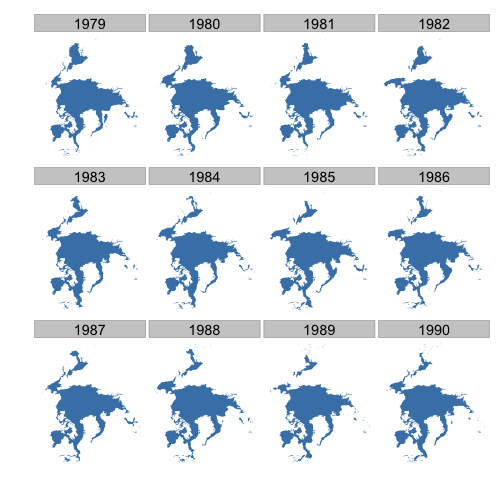

## NOAA climate data: Plot sea ice data

### Map sea ice for 12 years, for April only, for the North pole


```r
library(scales)
library(ggplot2)
library(doMC)
library(plyr)
library(rnoaa)
```


### Get URLs for data


```r
urls <- seaiceeurls(mo = "Apr", pole = "N")[1:12]
```


### Download sea ice data


```r
# registerDoMC(cores = 2) out <- llply(urls, noaa_seaice, storepath='~/',
# .parallel = TRUE)
out <- lapply(urls, noaa_seaice, storepath = "~/")
```

```r
names(out) <- seq(1979, 1990, 1)
df <- ldply(out)
head(df)
```

```
   .id     long     lat order  hole piece group id
1 1979 -1950000 2750000     1 FALSE     1   0.1  0
2 1979 -1875000 2750000     2 FALSE     1   0.1  0
3 1979 -1875000 2700000     3 FALSE     1   0.1  0
4 1979 -1900000 2700000     4 FALSE     1   0.1  0
5 1979 -1900000 2725000     5 FALSE     1   0.1  0
6 1979 -1925000 2725000     6 FALSE     1   0.1  0
```


### Plot data


```r
ggplot(df, aes(long, lat, group = group)) + geom_polygon(fill = "steelblue") + 
    theme_ice() + facet_wrap(~.id)
```

 

