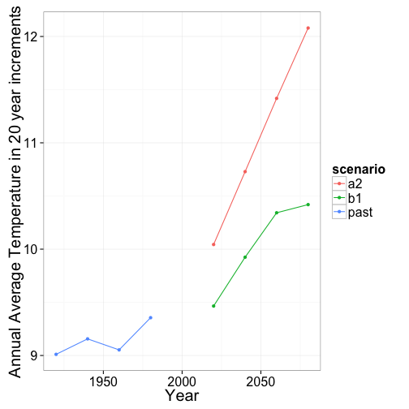
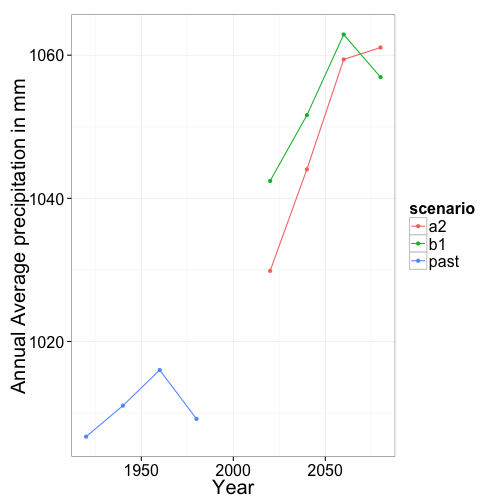

Introduction to rWBclimate
========================================================

The [ROpenSci](http://www.ropensci.org) package `rWBclimate` provides full access to all the climate data provided by the [World Bank](http://www.worldbank.org/) via their [climate data api](http://data.worldbank.org/developers/climate-data-api).  The package provides an easy way to download data for research and visualization purposes.  While the package provides access to a tremendous amount of data we wil focus on a few simple examples.  Full documentation and detailed examples can be found at the [package website](https://github.com/ropensci/rWBclimate).

Let's begin by loading the necessary libraries.


```r
library('rWBclimate')
library('ggplot2')
```


### Downloading ensemble climate data

The package can download data for any of the 13 major climate models, but it also offers provides access to ensemble data derived from all models.  We'll focus on this for our examples.  Model data is provided both for the past as a backcasting, and for the future.  Output for both only comes in 20 year averages.  Here we'll plot temperature data for Great Britain for the past as well as two [climate scenarios](http://climatesanity.wordpress.com/tag/global-depletion-of-groundwater-resources/), A2 and B1.

+ Grab temp data
+ Subset to just the median percentile
+ Plot and note the past is the same for each scenario


```r
gbr_dat_t <- get_ensemble_temp("GBR", "annualavg", 1900,2100)
gbr_dat_t <- subset(gbr_dat_t, gbr_dat_t$percentile == 50)
gbr_dat_t$data <- unlist(gbr_dat_t$data)

ggplot(gbr_dat_t, aes(x=fromYear, y=data, group=scenario, colour=scenario)) + 
  theme_bw(base_size=20) + 
  geom_point() + 
  geom_path() + 
  labs(x="Year", y="Annual Average Temperature in 20 year increments")
```

 

As you can see the A2 scenario of unchecked growth predicts a higher annual average temperature.  We can look at the same kind of data except this time examining changes in precipitation.


```r
gbr_dat_p <- get_ensemble_precip("GBR", "annualavg", 1900,2100)
gbr_dat_p <- subset(gbr_dat_p, gbr_dat_p$percentile == 50)
gbr_dat_p$data <- unlist(gbr_dat_p$data)
ggplot(gbr_dat_p, aes(x=fromYear, y=data, group=scenario, colour=scenario)) + 
  theme_bw(base_size=20) + 
  geom_point() + 
  geom_path() + 
  labs(x="Year", y="Annual Average precipitation in mm")
```

 

Here the difference between predicted increases in precipitation are less drastic when comparing the two different scenarios.
