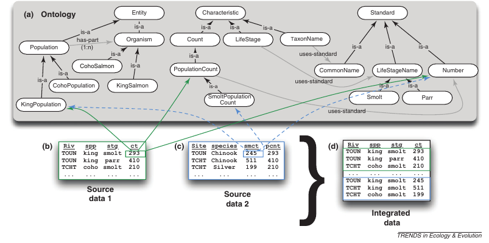

```{r}
library(ggplot2)
```

## Vertically integrated data repositories


## World Bank Climate Data (Example)

IPCC records and model projections at your fingertips

```{r }
library("rWBclimate")
country.list <- c("USA", "CAN")
country.dat <- get_historical_temp(country.list, "year")
plot <- ggplot(country.dat, aes(x = year, y = data, group = locator)) +
  geom_point() + geom_path() + xlab("Year") +
  ylab("Average annual temperature") +
  stat_smooth(se = F, colour = "black") +
  facet_wrap(~locator, scale = "free") + theme_bw()
```

## World Bank Climate Data (Example)

IPCC records and model projections at your fingertips

```{r echo=FALSE, message=FALSE}
plot
```

<!--

-->


## Factory Farm Data...


 credit: Arthus-Bertrand 


## ... Organic, hand-crafted variety


 credit: Arthus-Bertrand 


## Limitations to vertical integration


## Metadata Standards


 Jones+ (2006) doi: [ 10.1146/annurev.ecolsys.37.091305.110031](http://doi.org/10.1146/annurev.ecolsys.37.091305.110031) 


## KNB

<iframe src="https://knb.ecoinformatics.org/#data/page/0" height="600" width="100%" frameborder="0"></iframe>

## Quality vs Quantity

- There are no good data, bad data
- Some are just missing metadata

## Communicating data limitations

> effective interdisciplinary communication of data limitations with regard to, for example,

- spatial and temporal sampling uncertainties;
- instrument changes;
- quality-control procedures; and, in particular,
- what model-based climate predictions or projections do well and not so well.


  Overpeck+ (2011) doi: [ 10.1126/science.1197869](http://doi.org/10.1126/science.1197869)  

## EML

- <h2> Easy to <strong>use</strong> existing metadata </h2>
- <h2> Easy to <strong>generate</strong> metadata </h2>
- <h2> Easy to <strong>enhance</strong> & improve data with further annotation </h2>


## Formal semantics



Mitchner (2012) doi: [ 10.1016/j.tree.2011.11.016](http://doi.org/10.1016/j.tree.2011.11.016)


## How a new student sees a paper


## How a leading professor sees it


## How a computer sees it


## Metaknowledge


Evans+ doi: [ 10.1126/science.1201765](http://doi.org/10.1126/science.1201765) 


